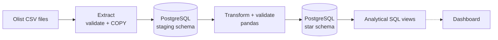
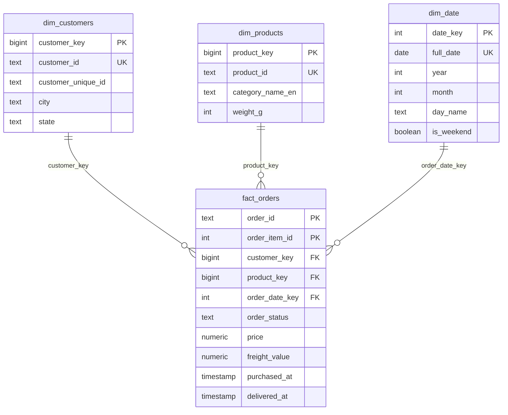

# E-commerce Data Pipeline

An end-to-end ETL pipeline that turns raw e-commerce CSV files into a clean PostgreSQL
star schema, ready for analytical SQL. Built with Python, pandas, SQLAlchemy, PostgreSQL
and Docker.


> **Status:** work in progress. Milestones 1 to 5 are done: the pipeline runs from the CSV
> files to a star schema and analytical views in PostgreSQL. Polish and an optional
> dashboard are next, see the [roadmap](#roadmap).

## Architecture



Solid arrows are implemented, dotted arrows are planned. The star schema contains
`fact_orders`, `dim_customers`, `dim_products` and `dim_date`.

## Tech stack

Python 3.12 · pandas · SQLAlchemy 2 · psycopg 3 · PostgreSQL 16 · Typer · Docker Compose ·
pytest · ruff · pre-commit · GitHub Actions

## Quick start

Requirements: Python 3.12+, Docker.

**Windows (PowerShell)**

```powershell
git clone https://github.com/danny-dunhill/ecommerce-data-pipeline.git
cd ecommerce-data-pipeline
copy .env.example .env                 # then edit the password
python -m venv .venv
.venv\Scripts\Activate.ps1
pip install -e ".[dev]"
docker compose up -d --wait db         # start PostgreSQL
pipeline check-db                      # verify the database connection
```

**macOS / Linux**

```bash
git clone https://github.com/danny-dunhill/ecommerce-data-pipeline.git
cd ecommerce-data-pipeline
cp .env.example .env                   # then edit the password
python -m venv .venv && source .venv/bin/activate
make install                           # install package + dev tools
make up                                # start PostgreSQL in Docker
pipeline check-db                      # verify the database connection
```

## Data

The data is the [Olist Brazilian E-Commerce Public Dataset](https://www.kaggle.com/datasets/olistbr/brazilian-ecommerce)
(about 100 000 orders from 2016 to 2018, 9 related CSV files), created by Olist and
published on Kaggle under the
[CC BY-NC-SA 4.0](https://creativecommons.org/licenses/by-nc-sa/4.0/) license. The full
dataset is not part of this repository. `data/sample/` contains a small random sample of
it, shared under the same license (see [`data/sample/README.md`](data/sample/README.md)).
This project is not endorsed by Olist.

1. Download the dataset from Kaggle and unzip it.
2. Copy the CSV files into `data/raw/`.

`olist_geolocation_dataset.csv` is not used: latitude and longitude are not needed for the
revenue and product analysis, and the file has about one million rows.

## Usage

```bash
pipeline make-sample                          # build a small sample in data/sample (once)
pipeline load-staging --data-dir data/sample  # load the sample into PostgreSQL
pipeline load-staging                         # load the full data from data/raw
pipeline validate                             # clean the staging data and run quality checks
pipeline load-warehouse                       # validate, then load the star schema
pipeline run --data-dir data/sample           # all of the above in one command
pipeline report monthly-revenue               # print an analytical report
pipeline report top-products --limit 10
pipeline report repeat-customers
```

Run `pipeline --help` for all commands. Exit codes: `0` success, `1` database problem,
`2` bad configuration or arguments, `3` problem with the data (missing files, unexpected
columns, row count mismatch).

## Example results

These results come from one run on the **full** Olist dataset (`pipeline run --data-dir data/raw`,
about 100 000 orders). The warehouse load processed 246 138 rows in about 40 seconds on a
personal computer with Docker Desktop, and the data-quality checks found no blocking errors.

| Table                | Rows    |
| -------------------- | ------- |
| `dw.dim_date`        | 1 096   |
| `dw.dim_customers`   | 99 441  |
| `dw.dim_products`    | 32 951  |
| `dw.fact_orders`     | 112 650 |

`pipeline report monthly-revenue --limit 13` (revenue is the item price without freight;
canceled and unavailable orders are not counted):

```text
year  month  month_start  orders  items       revenue     freight  avg_order_value  revenue_growth_pct
----  -----  -----------  ------  -----  ------------  ----------  ---------------  ------------------
2017      9  2017-09-01     4227   4815    621,415.91   95,686.81           147.01                9.40
2017     10  2017-10-01     4547   5300    660,179.62  104,576.41           145.19                6.20
2017     11  2017-11-01     7421   8626  1,003,862.14  168,329.54           135.27               52.10
2017     12  2017-12-01     5618   6300    742,183.79  119,342.98           132.11              -26.10
2018      1  2018-01-01     7187   8173    945,456.29  156,463.72           131.55               27.40
2018      2  2018-02-01     6624   7597    837,895.43  141,590.73           126.49              -11.40
2018      3  2018-03-01     7168   8195    981,051.06  171,605.93           136.87               17.10
2018      4  2018-04-01     6919   7957    993,592.98  162,655.91           143.60                1.30
2018      5  2018-05-01     6833   7898    992,871.75  152,814.71           145.31               -0.10
2018      6  2018-06-01     6145   7060    863,265.53  157,116.37           140.48              -13.10
2018      7  2018-07-01     6233   7039    878,044.27  161,739.31           140.87                1.70
2018      8  2018-08-01     6421   7216    848,860.10  148,113.41           132.20               -3.30
2018      9  2018-09-01        1      1        145.00       21.46           145.00             -100.00
```

`pipeline report top-products --limit 10`:

```text
revenue_rank  product_id                        category               units_sold  orders    revenue
------------  --------------------------------  ---------------------  ----------  ------  ---------
           1  bb50f2e236e5eea0100680137654686c  health_beauty                 195     187  63,885.00
           2  6cdd53843498f92890544667809f1595  health_beauty                 156     151  54,730.20
           3  d6160fb7873f184099d9bc95e30376af  computers                      35      35  48,899.34
           4  d1c427060a0f73f6b889a5c7c61f2ac4  computers_accessories         341     321  46,916.51
           5  99a4788cb24856965c36a24e339b6058  bed_bath_table                487     466  42,938.66
           6  3dd2a17168ec895c781a9191c1e95ad7  computers_accessories         274     255  41,082.60
           7  25c38557cf793876c5abdd5931f922db  baby                           38      38  38,907.32
           8  5f504b3a1c75b73d6151be81eb05bdc9  cool_stuff                     63      63  37,733.90
           9  53b36df67ebb7c41585e8d54d6772e08  watches_gifts                 323     306  37,683.42
          10  aca2eb7d00ea1a7b8ebd4e68314663af  furniture_decor               527     431  37,608.90
```

`pipeline report repeat-customers`:

```text
customers  repeat_customers  repeat_rate_pct  repeat_revenue_share_pct
---------  ----------------  ---------------  ------------------------
    94983              2887             3.04                      5.60
```

What the numbers say:

- Monthly revenue grew from about 120 000 in January 2017 to about 1 million in November
  2017, the month of Black Friday. In 2018 it stays between roughly 850 000 and 990 000.
- The dataset practically ends in August 2018: September 2018 has one order, which is why
  its growth is -100 %. The first months of the dataset are just as thin, so their growth
  percentages are huge and not meaningful. That is why the table above starts in
  September 2017.
- Only **3 % of the customers ordered more than once**, and they bring 5.6 % of the
  revenue. Most of the revenue comes from first-time buyers.
- Revenue and popularity are different rankings: the third best product sold 35 units, the
  fifth sold 487.

## Staging layer

`pipeline load-staging` copies each CSV file 1:1 into a table of the `staging` schema:

| Source file                         | Staging table                        |
| ----------------------------------- | ------------------------------------ |
| `olist_customers_dataset.csv`       | `staging.customers`                  |
| `olist_orders_dataset.csv`          | `staging.orders`                     |
| `olist_order_items_dataset.csv`     | `staging.order_items`                |
| `olist_order_payments_dataset.csv`  | `staging.order_payments`             |
| `olist_order_reviews_dataset.csv`   | `staging.order_reviews`              |
| `olist_products_dataset.csv`        | `staging.products`                   |
| `olist_sellers_dataset.csv`         | `staging.sellers`                    |
| `product_category_name_translation.csv` | `staging.product_category_translation` |

Design decisions:

- **Raw copy, all columns `TEXT`.** Staging keeps the source exactly as delivered.
  Cleaning and typing happen in the transform step, so the transformations can be re-run
  at any time without downloading anything again.
- **PostgreSQL `COPY`** streams a whole file in one command. It is much faster than
  inserting row by row, and it handles quoted fields with commas and line breaks
  (review comments).
- **Idempotent.** Each table is dropped and re-created before loading, so running the
  load twice gives the same result and never duplicates rows.
- **Atomic.** All tables are loaded in a single transaction. If anything fails, the
  previous state stays untouched.
- **Validated up front and reconciled afterwards.** Files and column names are checked
  before the database is touched, and the row count in the database must equal the number
  of records in each CSV file.
- **Empty values become `NULL`**, whether the CSV file wrote them as `""` or as nothing.
- **Every row has `_loaded_at`**, the time of the load.

## Transform and data quality

`pipeline validate` reads the staging tables into pandas, cleans and types them
(`transform.py`) and runs the data-quality checks (`quality.py`). It writes nothing, so it
is always safe to run. `pipeline load-warehouse` runs the same step before it loads.

Cleaning (every function is pure: DataFrame in, new DataFrame out):

- text is trimmed, empty strings become missing values, state codes are upper-case,
  cities title-case, zip codes stay 5-character text (a leading zero must survive)
- timestamps and numbers get real types; money is rounded to cents
- the misspelled source columns (`product_name_lenght`) are renamed
- products get an English category name (falls back to the Portuguese name, then to
  `unknown`)
- **no row is ever dropped or silently "fixed"**

Two kinds of problems are treated differently on purpose:

- **Type problems** (a price that is not a number, an unknown timestamp format) stop the run
  at once with a clear message: the source is not what we expect.
- **Business-rule problems** are reported by the checks below, each with a severity.
  A failed **error** blocks the pipeline (exit code 3); a **warning** is only reported.

| Check                        | Severity | Rule                                                   |
| ---------------------------- | -------- | ------------------------------------------------------ |
| `customers_key`, `products_key`, `orders_key`, `order_items_key` | error | primary keys are present and unique |
| `orders_customer_exists`, `items_order_exists`, `items_product_exists` | error | no orphan rows (foreign keys) |
| `orders_have_purchase_time`  | error    | every order has a purchase timestamp                   |
| `orders_status_known`        | error    | status is one of the 8 known values                    |
| `items_amounts_valid`, `payments_amount_valid` | error | amounts are present and not negative     |
| `delivery_after_purchase`    | warning  | an order is not delivered before it was purchased      |
| `delivered_has_delivery_date`| warning  | "delivered" orders have a delivery date                |
| `orders_have_items`          | warning  | every order has at least one item                      |
| `products_have_category`     | warning  | every product has a category                           |

The real Olist data has a few known oddities (orders without items, products without a
category), so warnings there are expected: they are findings to report, not to hide.

## Star schema

`pipeline load-warehouse` builds the star schema in the `dw` schema of PostgreSQL. It
validates first: if a blocking data-quality check fails, nothing is loaded (exit code 3).



The full table definitions are in
[`src/ecom_pipeline/sql/star_schema.sql`](src/ecom_pipeline/sql/star_schema.sql).

Design decisions:

- **Grain: one fact row per order item.** Revenue by product needs the product of every
  line, so an order with three products becomes three rows. Orders without any item add no
  revenue and are not in the fact table (they are reported as a warning by `validate`).
- **Surrogate keys** (`customer_key`, `product_key`) are generated by the database and
  never change. The source ids stay as unique columns, so the facts can find their
  dimension rows. `order_id` stays in the fact table as a *degenerate dimension*.
- **`customer_id` vs `customer_unique_id`.** In the source, `customer_id` is created for
  every order and `customer_unique_id` identifies the real person. The dimension has one
  row per `customer_id`, and "repeat customers" group by `customer_unique_id`.
- **`dim_date` is generated**, not loaded: one row per day for the whole calendar years
  that contain orders, so that every month in a report is a complete month.
- **Upserts** (`INSERT ... ON CONFLICT DO UPDATE`). Each table is streamed with `COPY` into
  a temporary table and then merged into the real table. New rows are inserted, changed
  rows are updated, and unchanged rows are not even rewritten
  (`WHERE ... IS DISTINCT FROM`). Running the load again gives the same result and keeps
  the surrogate keys stable.
- **Atomic.** The schema, the dimensions and the facts are loaded in one transaction. The
  number of fact rows that find both their customer and their product is checked, so no
  row can silently disappear.
- **Money is `NUMERIC(12,2)`**, not a float, so sums are exact.
- **Limits, on purpose:** the load only inserts and updates, a row that disappears from
  the source is not deleted. The schema script creates missing tables but does not migrate
  existing ones (a real project would use Alembic or dbt).

## Analytics

The `analytics` schema is the layer that analysts and BI tools query. It consists of SQL
views, defined in
[`src/ecom_pipeline/sql/analytics_views.sql`](src/ecom_pipeline/sql/analytics_views.sql) and
re-created on every load (a view holds no data, so it is simply dropped and created again).

| View                            | Answers                                                              |
| ------------------------------- | -------------------------------------------------------------------- |
| `analytics.sales_items`         | The one definition of "a sale": items of orders that were not canceled or unavailable |
| `analytics.monthly_revenue`     | Revenue, orders, items, freight, average order value and growth per month |
| `analytics.top_products`        | Every sold product ranked by revenue (`revenue_rank`)                |
| `analytics.customer_orders`     | Orders and revenue per real person (`customer_unique_id`)            |
| `analytics.repeat_customers`    | How many customers ordered more than once, and their share of revenue |

Design decisions:

- **One definition of revenue.** All views start from `analytics.sales_items`, so they can
  never disagree about what counts as a sale. Revenue is the item price without freight.
- **Repeat customers are counted per person**, not per `customer_id` (which changes with
  every order in the source data).
- **Window functions** (`lag`, `rank`) give the month-over-month growth and the product
  ranking in SQL, where the data is, instead of in Python. `lag` looks at the previous
  *row*, so growth is only reported when that row is really the previous calendar month;
  after a month without sales it is empty instead of a misleading multi-month change.
- **Division by zero is handled** (`nullif`), so the views also work on an empty warehouse.

`pipeline report <name>` prints a view as a table (`--limit N` sets the number of rows;
for `monthly-revenue` it keeps the *latest* N months). More queries you can run in any SQL
client are in [`sql/example_queries.sql`](sql/example_queries.sql): revenue by state and
category, weekday versus weekend, delivery time.

## Development

```bash
pytest                    # all tests with coverage (make test)
ruff check .              # lint (make lint)
ruff format .             # auto-format (make format)
```

Integration tests need a running PostgreSQL (`docker compose up -d --wait db`). They are
skipped automatically if the database is not reachable, and they always run in CI.

## Roadmap

- [x] 1. Project skeleton: config, logging, CLI, Docker Compose, CI, tests
- [x] 2. Extract: validate the CSV files and load them into a staging schema (idempotent)
- [x] 3. Transform and validate: cleaning, typing, data-quality checks (`pipeline validate`)
- [x] 4. Load: star schema with upserts (`pipeline load-warehouse`, `pipeline run`)
- [x] 5. Analytics: SQL views (monthly revenue, top products, repeat customers) and `pipeline report`
- [ ] 6. Polish: documentation, coverage, example results
- [ ] 7. Optional: dashboard, Airflow orchestration

## License

The source code is licensed under MIT, see [LICENSE](LICENSE). The Olist data (and the
sample derived from it) is licensed under
[CC BY-NC-SA 4.0](https://creativecommons.org/licenses/by-nc-sa/4.0/): attribution is
required, commercial use is not allowed, and adaptations must use the same license.
