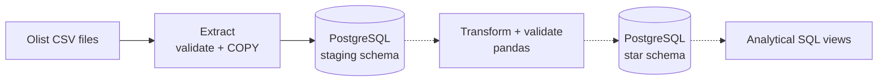

# E-commerce Data Pipeline

An end-to-end ETL pipeline that turns raw e-commerce CSV files into a clean PostgreSQL
star schema, ready for analytical SQL. Built with Python, pandas, SQLAlchemy, PostgreSQL
and Docker.


> **Status:** work in progress. Milestones 1 (project skeleton) and 2 (extract and staging
> load) are done, see the [roadmap](#roadmap).

## Architecture



Solid arrows are implemented, dotted arrows are planned. The star schema will contain
`fact_orders`, `dim_customers`, `dim_products` and `dim_date`.

## Tech stack

Python 3.12 · pandas · SQLAlchemy 2 · psycopg 3 · PostgreSQL 16 · Typer · Docker Compose ·
pytest · ruff · pre-commit · GitHub Actions

## Quick start

Requirements: Python 3.12+, Docker.

**Windows (PowerShell)**

```powershell
git clone https://github.com/danny-dunhill/ecommerce-data-pipeline.git
cd ecommerce-data-pipeline
copy .env.example .env                 # then edit the password
python -m venv .venv
.venv\Scripts\Activate.ps1
pip install -e ".[dev]"
docker compose up -d --wait db         # start PostgreSQL
pipeline check-db                      # verify the database connection
```

**macOS / Linux**

```bash
git clone https://github.com/danny-dunhill/ecommerce-data-pipeline.git
cd ecommerce-data-pipeline
cp .env.example .env                   # then edit the password
python -m venv .venv && source .venv/bin/activate
make install                           # install package + dev tools
make up                                # start PostgreSQL in Docker
pipeline check-db                      # verify the database connection
```

## Data

The data is the [Olist Brazilian E-Commerce Public Dataset](https://www.kaggle.com/datasets/olistbr/brazilian-ecommerce)
(about 100 000 orders from 2016 to 2018, 9 related CSV files), created by Olist and
published on Kaggle under the
[CC BY-NC-SA 4.0](https://creativecommons.org/licenses/by-nc-sa/4.0/) license. The full
dataset is not part of this repository. `data/sample/` contains a small random sample of
it, shared under the same license (see [`data/sample/README.md`](data/sample/README.md)).
This project is not endorsed by Olist.

1. Download the dataset from Kaggle and unzip it.
2. Copy the CSV files into `data/raw/`.

`olist_geolocation_dataset.csv` is not used: latitude and longitude are not needed for the
revenue and product analysis, and the file has about one million rows.

## Usage

```bash
pipeline make-sample                          # build a small sample in data/sample (once)
pipeline load-staging --data-dir data/sample  # load the sample into PostgreSQL
pipeline load-staging                         # load the full data from data/raw
```

Run `pipeline --help` for all commands. Exit codes: `0` success, `1` database problem,
`2` bad configuration or arguments, `3` problem with the data (missing files, unexpected
columns, row count mismatch).

## Staging layer

`pipeline load-staging` copies each CSV file 1:1 into a table of the `staging` schema:

| Source file                         | Staging table                        |
| ----------------------------------- | ------------------------------------ |
| `olist_customers_dataset.csv`       | `staging.customers`                  |
| `olist_orders_dataset.csv`          | `staging.orders`                     |
| `olist_order_items_dataset.csv`     | `staging.order_items`                |
| `olist_order_payments_dataset.csv`  | `staging.order_payments`             |
| `olist_order_reviews_dataset.csv`   | `staging.order_reviews`              |
| `olist_products_dataset.csv`        | `staging.products`                   |
| `olist_sellers_dataset.csv`         | `staging.sellers`                    |
| `product_category_name_translation.csv` | `staging.product_category_translation` |

Design decisions:

- **Raw copy, all columns `TEXT`.** Staging keeps the source exactly as delivered.
  Cleaning and typing happen in the transform step, so the transformations can be re-run
  at any time without downloading anything again.
- **PostgreSQL `COPY`** streams a whole file in one command. It is much faster than
  inserting row by row, and it handles quoted fields with commas and line breaks
  (review comments).
- **Idempotent.** Each table is dropped and re-created before loading, so running the
  load twice gives the same result and never duplicates rows.
- **Atomic.** All tables are loaded in a single transaction. If anything fails, the
  previous state stays untouched.
- **Validated up front and reconciled afterwards.** Files and column names are checked
  before the database is touched, and the row count in the database must equal the number
  of records in each CSV file.
- **Empty values become `NULL`**, whether the CSV file wrote them as `""` or as nothing.
- **Every row has `_loaded_at`**, the time of the load.

## Development

```bash
pytest                    # all tests with coverage (make test)
ruff check .              # lint (make lint)
ruff format .             # auto-format (make format)
```

Integration tests need a running PostgreSQL (`docker compose up -d --wait db`). They are
skipped automatically if the database is not reachable, and they always run in CI.

## Roadmap

- [x] 1. Project skeleton: config, logging, CLI, Docker Compose, CI, tests
- [x] 2. Extract: validate the CSV files and load them into a staging schema (idempotent)
- [ ] 3. Transform and validate: cleaning, data quality checks
- [ ] 4. Load: star schema with upserts
- [ ] 5. Analytics: SQL views (monthly revenue, top products, repeat customers)
- [ ] 6. Polish: documentation, coverage, example results
- [ ] 7. Optional: dashboard, Airflow orchestration

## License

The source code is licensed under MIT, see [LICENSE](LICENSE). The Olist data (and the
sample derived from it) is licensed under
[CC BY-NC-SA 4.0](https://creativecommons.org/licenses/by-nc-sa/4.0/): attribution is
required, commercial use is not allowed, and adaptations must use the same license.
