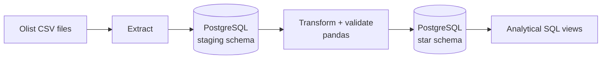

# E-commerce Data Pipeline

An end-to-end ETL pipeline that turns raw e-commerce CSV files into a clean PostgreSQL
star schema, ready for analytical SQL. Built with Python, pandas, SQLAlchemy, PostgreSQL
and Docker.


> **Status:** work in progress. Milestone 1 (project skeleton) is done, see the
> [roadmap](#roadmap).

## Architecture (target)



The star schema will contain `fact_orders`, `dim_customers`, `dim_products` and `dim_date`.

## Tech stack

Python 3.12 · pandas · SQLAlchemy 2 · PostgreSQL 16 · Typer · Docker Compose · pytest ·
ruff · pre-commit · GitHub Actions

## Quick start

Requirements: Python 3.12+, Docker.

```bash
git clone https://github.com/danny-dunhill/ecommerce-data-pipeline.git
cd ecommerce-data-pipeline
cp .env.example .env          # then edit the password
python -m venv .venv && source .venv/bin/activate
make install                  # install package + dev tools + git hooks
make up                       # start PostgreSQL in Docker
pipeline check-db             # verify the database connection
```

Run `make help` to see all available commands.

## Development

```bash
make lint      # ruff check + format check
make format    # auto-fix style problems
make test      # pytest with coverage
```

Integration tests need a running PostgreSQL (`make up`). They are skipped automatically if
the database is not reachable, and they always run in CI.

## Roadmap

- [x] **1. Project skeleton:** config, logging, CLI, Docker Compose, CI, tests
- [ ] 2. Extract: load raw CSVs into a staging schema (idempotent)
- [ ] 3. Transform and validate: cleaning, data quality checks
- [ ] 4. Load: star schema with upserts
- [ ] 5. Analytics: SQL views (monthly revenue, top products, repeat customers)
- [ ] 6. Polish: documentation, coverage, example results
- [ ] 7. Optional: dashboard, Airflow orchestration

## License

MIT, see [LICENSE](LICENSE).
